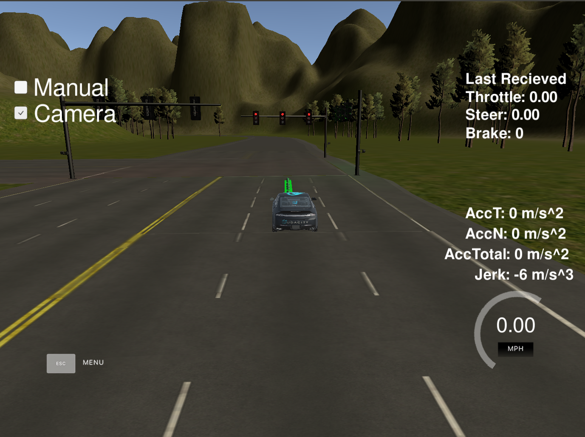
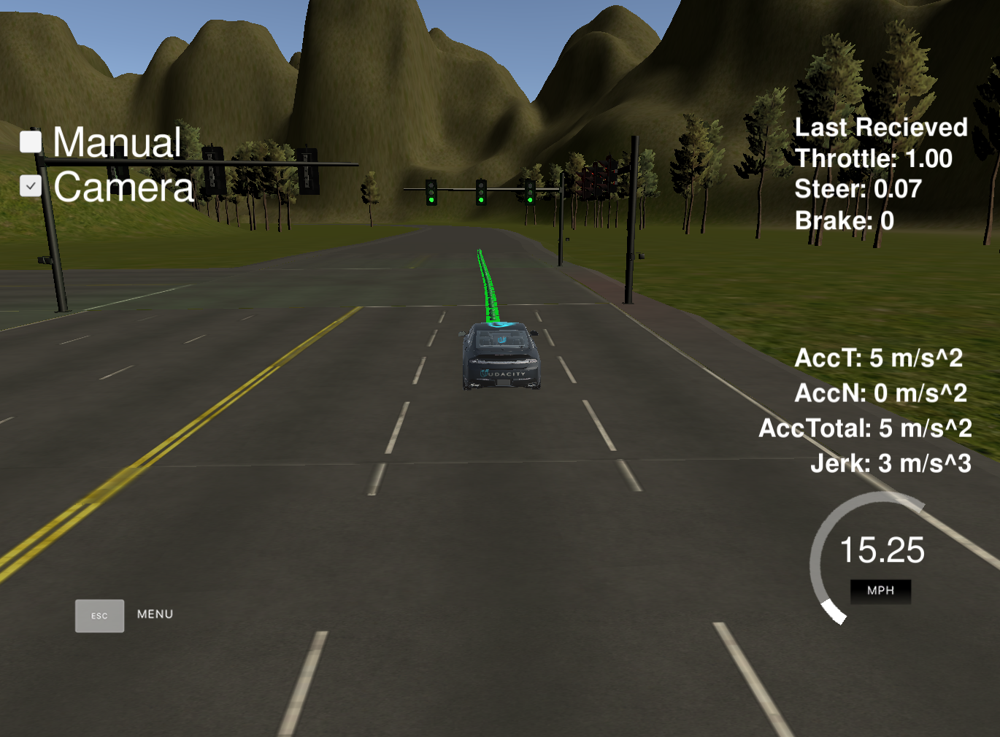
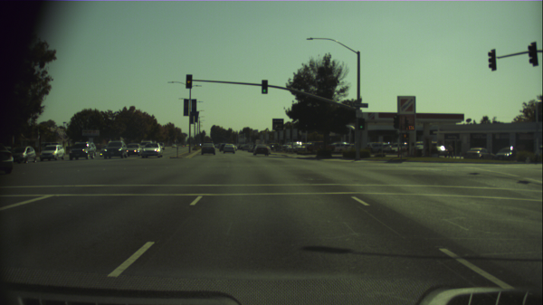
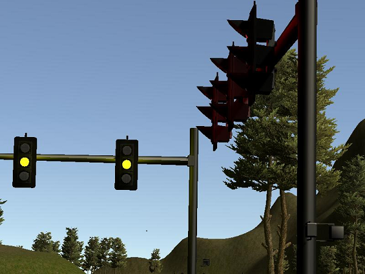
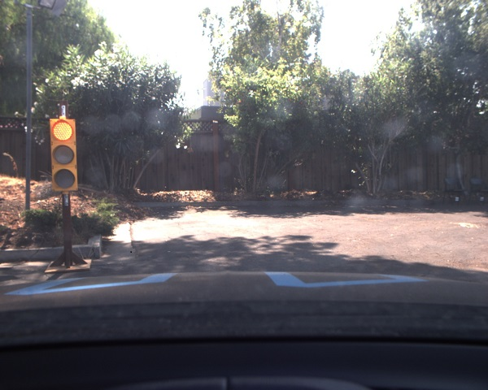
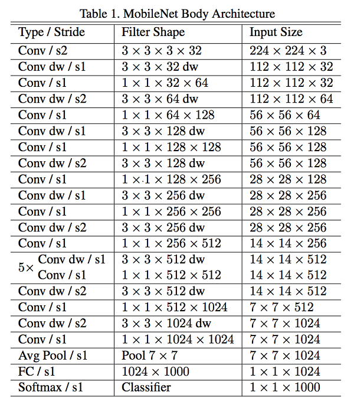
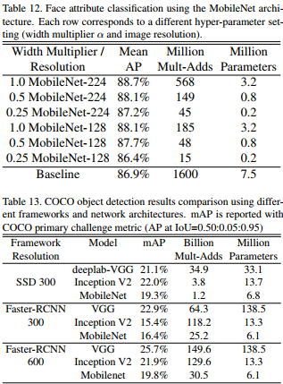
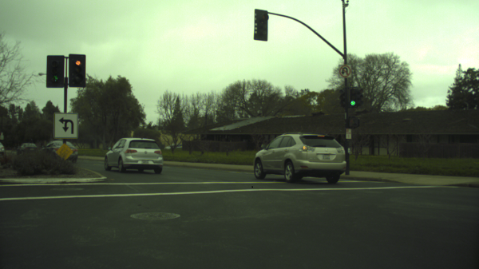

# Self-Driving Car Nanodegree Capstone Project (Team: ThinkLikeCar)

## Overview

This repo contains the submissions and related material for "Team: Think Like Car" for Udacity "Self Driving Car" Nano degree program's Term 3 - Project 3, "System-Integration"

## Goal of the project
The main goal of the project is to write different nodes of ROS, to be able to successfully run the code on Udacity self driving car "Carla". The code will be first tested on simulator then on car. The key implementations are :

+ Detection of Traffic lights - RED, YELLOW, GREEN
+ Stopping car on RED, moving on GREEN
+ Sending the control command on drive by wire, for throttle, brake and steering for car to be controlled and be able to move.

## Team Member

<table>
 <tr>
    <th>Member</th>
    <th>Email</th>
    <th>&nbsp;</th>
    
 </tr>
 
 <tr>
    <td>Sulabh Matele</td>
    <td>sulabhmatele@gmail.com</td>
    <td> </td>
 </tr>
 
 <tr>
    <td>Clint Adams</td>
    <td>clintonadams23@gmail.com</td>
    <td>  </td>
 </tr>
 
 <tr>
    <td>Sunil Prakash</td>
    <td>prakashsunil@gmail.com</td>
    <td></td>
 </tr>
 
 <tr>
    <td>Ankit Jain</td>
    <td>asj.ankit@gmail.com</td>
    <td></td>
 </tr>
 
 <tr>
    <td>Frank Xia</td>
    <td>tyxia2004@gmail.com</td>
    <td></td>
 </tr>
 
</table>

## Simulator 

<table>
 <tr>
    <th>Description</th>
    <th>&nbsp;</th>
 </tr>
 
 <tr>
    <td>Car stopping on RED</td>
    <td> </td>
 </tr>
 
 <tr>
    <td>Car moves back on GREEN</td>
    <td>  </td>
 </tr>
 
</table>

## Overall autonomous car overview in a picture

## System-Integration Architecture Diagram
Here we use ROS nodes to implement core functionality of the autonomous vehicle system, including traffic light detection, control, and waypoint following. The code was tested in a simulator, and later run on [Carla](https://medium.com/udacity/how-the-udacity-self-driving-car-works-575365270a40), the Udacity's own self-driving car. 

The following is a system architecture diagram showing the ROS nodes and topics used in the project.

## ROS Node
### Waypoint Updater node (waypoint_updater)

The main responsibilities of this node are:
+ This node listens for the `/base_waypoints` topic sent by `Waypoint Loader` node. This topic sends all the available waypoints at the start and then never updates. 
+ This node stores all the waypoints and sends a chunk of waypoints at a time, when it receives the current vehicle position from simulator/car.
+ This node listens for `/current_pose` topic to receive car's current position. Then decides to send the required number of future waypoints to follow by publishing `final_waypoints`
+ This node also listens for `/traffic_waypoint` and `/obstacle_waypoint` topics to receive the information about RED signal and obstacle on road if any.
+ When RED light is detected by `tl_classifier` then it sends the RED light waypoint index, and then waypoint updater starts setting velocities for future waypoints to make car stop at the RED light waypoint.
+ Once the light turns GREEN, then `tl_classifier` again informs to waypoint updater. and waypoint updater sends next waypoints with required velocity to make car moving.

Different challenges in implementation of Waypoint Updater:
+ The main challenge was to efficiently detecting the nearest waypoint to the car position, this was resolved by checking the Euclidean distance between the simulator reported car position to the list of waypoints using method `euclidean_dist` and then if the distance is increasing for 25 waypoints then break the loop.
+ The next challenge was to handle the stopping and starting car on RED and GREEN :
  + When the traffic light turns RED, it sets `self.is_stop_req` so waypoint updater stats setting velocities in advance upto `self.decrement_factor` advanced waypoints. When car stops on RED, then we also stop sending new list of waypoints so, car keeps in stop position.
  + When the light turns GREEN, the request to stop `self.is_stop_req` gets clear and makes the method `pose_cb` to fill the waypoints with their velocities, which in turn moves the car.
+ The last challenge was to resolve the condition when the car is at end of the track and our list of waypoints is about to be finished. This condition is handled as an special condition and we set `self.short_of_points`, which then takes care of setting velocities to 0, near end of waypoints. 

### Twist Controller Node (dbw_node)
This node will read the current state and future velocity from the system to provide the best `(throttle, brake, steering)` tuple.

**Publisher**:

- `/vehicle/steering_cmd`: provide the steering angle of the next step.
- `/vehicle/throttle_cmd`: provide the throttle of the next step.
- `/vehicle/brake_cmd`: provide the brake of the next step.

**Subscriber**:

- `/twist_cmd`: the next angular and linear velocity of the car
- `/current_velocity`: the current velocity of the car
- `/dbw_enabled`: whether a driver is taking control of the car. If `false`, the controller will not do anything.

**Important features**:

- The current command frequency is set to 50HZ for optimal performance.
- The *steer* value is calculated using the `YawController` class with the given `wheel_base`, `steer_ratio`, `min_speed`, `max_lat_accel`, `max_steer_angle`
- The throttle value is calculated using `PID` class with 
    -   `kp = 2.0`
    -   `ki = 0.4`
    -   `kd = 0.1`
-   The brake value is calculated using `brake = vehicle_mass * wheel_radius * (current_v - target_v)/update_frequency`

### Traffic light detection node (tl_detector)

This node is responsible for the traffic light detection  and classifying. 
If the traffic light is found and is as red then it locates the closest waypoint to that red light's stop line and publishes the index of that waypoint to the /traffic_waypoint topic.

tl_detector node subscribes to the following topics:

- **/base_waypoints**: Waypoints for the whole track are published to this topic. This publication is a one-time only operation.
- **/current_pose**: To receive the current position of the vehicle.
- **/image_color**: To receive camera images to identify the traffic light state. Every time a new image is received, the traffic light node finds the location of the current car with respect to the traffic light, it is close to traffic light,
it calls the classifier to find the state of the light, if it is red, it sends the waypoint and traffic light index to waypoint_follower node.
- **/vehicle/traffic_lights**: If ground truth data has been created. 
This topic provides the location of the traffic light in the map space and helps acquiring an accurate ground truth data source for the traffic light classifier by sending the current color state of all traffic lights in the simulator. 

##### Training Data
[Bosch's taffic light dataset](https://hci.iwr.uni-heidelberg.de/node/6132)

example:

Hand labeled Udacity Simulator data

example:

Hand labeled [Udacity Traffic Light Detection Test Video data](https://drive.google.com/file/d/0B2_h37bMVw3iYkdJTlRSUlJIamM/view?usp=sharing)

example:

Train data count: 11125
Validation data count: 3178
Test data count: 1589

##### Approach
For the task of classifying traffic lights, we fed images recorded from the vehicles camera through a convolutional neural network. Because the classifier would be running at high frequency, in real time, we needed an architecture with relatively few parameters. A fine-tuned [Mobilenet](https://arxiv.org/pdf/1704.04861.pdf) offered a good balance between efficiency and accuracy. 

Because we have data for stop line locations available, we decided not to use an object detection approach and instead classify entire images as containing, simply, a red, yellow, or green light. It can be seen in the [Mobilenet paper](https://arxiv.org/pdf/1704.04861.pdf) that using an object detection based approach such as Faster-RCNN or SSD brings the number of mult-adds from the order of millions to the order of billions. We felt this was an unncessary use of resources for the task, as defined.

Keras offers a [friendly api](https://keras.io/applications/#mobilenet) for loading a Mobilenet model pretrained on the imagenet dataset. We used this, along with various image augmentation techniques, to train the model we would use for classification. We quickly found that using Keras in the inference stage did not offer acceptable performance, however, so we converted the fine-tuned model to a tensorflow protobuf file. We also applied various optimizations, including freezing the graph and running the Tensorflow optimize_for_inference script. With this, we were able to get the inference time to less than 100 ms per image on a cpu.

##### Challenges
Acquiring training data was a major challenge. Bosch, helpfully, made their traffic light training data available. The Bosch data (realistically) contained many images that had more than one light, making it unclear what the singular label of that image should be. 

Bosch labeled the data with bounding boxes instead of a single label. To get around this, we labeled the images using the label of the largest bounding in each image.

Performance was another challenge. During testing, we utilized a simulator running on a virutal machine image with dependencies similar to what would be used on the car. We noticed a considerable amount of latency between each prediction. The natural assumption was that it was because of the model running inference. So we optimized and experimented with different Mobilenet hyper-parameters. After profiling it was revealed that there were sections of the code that could be optimized, and that the model was not the bottleneck. This solved the performance issues.  
